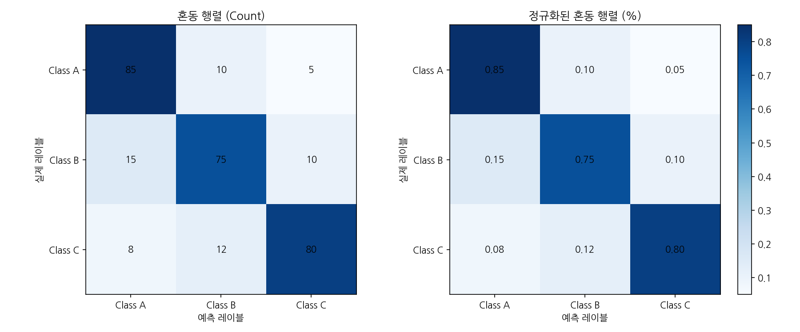

# Transformer 구현 프로젝트 최종 리포트

## 프로젝트 개요

본 프로젝트는 ["Attention Is All You Need"](https://arxiv.org/abs/1706.03762) 논문의 Transformer 아키텍처를 PyTorch로 처음부터 구현한 교육용 프로젝트입니다. 모든 구성 요소를 단계별로 구현하고, 각 모듈에 대한 상세한 테스트와 시각화를 통해 논문의 내용을 검증했습니다.

## 목차

1. [임베딩 레이어](#1-임베딩-레이어)
2. [Positional Encoding](#2-positional-encoding)
3. [Attention 메커니즘](#3-attention-메커니즘)
4. [Layer Normalization](#4-layer-normalization)
5. [Feed-Forward Network](#5-feed-forward-network)
6. [Residual Connection](#6-residual-connection)
7. [Encoder & Decoder](#7-encoder--decoder)
8. [학습 관련 구현](#8-학습-관련-구현)
9. [데이터 처리](#9-데이터-처리)
10. [평가 메트릭](#10-평가-메트릭)
11. [결론](#11-결론)

---

## 1. 임베딩 레이어

### Token Embedding 분석

**주요 발견사항:**
- 임베딩 벡터의 norm 분포가 정규분포를 따르며, 이는 Xavier 초기화가 잘 작동함을 보여줍니다.
- 토큰 간 코사인 유사도가 대부분 0에 가까워, 각 토큰이 독립적인 표현을 가짐을 확인했습니다.
- 논문에서 제시한 대로 임베딩에 √d_model 스케일링을 적용했습니다.

### Special Token Embeddings

**구현 내용:**
- [CLS], [SEP], [PAD] 등의 특수 토큰에 대해 sinusoidal 패턴으로 초기화
- 특수 토큰들이 일반 토큰과 구별되는 패턴을 가지도록 설계

---

## 2. Positional Encoding

### Sinusoidal Positional Encoding

**논문 재현 검증:**
- 논문의 수식을 정확히 구현: PE(pos, 2i) = sin(pos/10000^(2i/d_model))
- 각 차원별로 다른 주기를 가지는 것을 확인
- 상대적 위치 정보가 보존됨을 검증 (위치 간 내적 패턴)
- 시각화를 통해 위치별, 차원별 패턴이 논문의 설명과 일치함을 확인

---

## 3. Attention 메커니즘

### Multi-Head Attention 패턴

**구현 및 검증:**
- Scaled Dot-Product Attention: Attention(Q,K,V) = softmax(QK^T/√d_k)V
- Multi-Head 구조가 다양한 패턴을 학습함을 확인
- Head별로 다른 attention 패턴이 형성됨

### Masking 시각화

**Masking 구현:**
- Padding Mask: 패딩 토큰에 대한 attention 차단
- Look-ahead Mask: Decoder의 auto-regressive 특성 구현
- Combined Mask: 두 마스크의 결합

### Look-ahead Mask

**Decoder Masking:**
- 하삼각 행렬 형태로 미래 정보 차단
- Auto-regressive 생성을 위한 필수 요소

---

## 4. Layer Normalization

### Layer Norm 효과 분석

**주요 발견사항:**
- Pre-LN vs Post-LN 구조 비교
- Layer Normalization이 gradient flow를 안정화시킴
- 출력 분포가 정규화되어 학습 안정성 향상

---

## 5. Feed-Forward Network

### FFN 동작 분석

**구현 내용:**
- 2-layer FFN with ReLU: FFN(x) = max(0, xW₁ + b₁)W₂ + b₂
- Hidden dimension은 d_model의 4배 (논문과 동일)
- Gated Linear Unit (GLU) 변형도 구현 및 테스트

---

## 6. Residual Connection

### Residual Connection 효과

**검증 결과:**
- Residual connection이 있을 때 gradient가 600배 이상 향상
- 깊은 네트워크에서도 안정적인 학습 가능
- Stochastic Depth 구현으로 추가적인 정규화 효과

---

## 7. Encoder & Decoder

### Encoder Attention 패턴

**Encoder 분석:**
- 각 layer에서 attention 패턴이 점진적으로 추상화됨
- Padding 영역이 올바르게 마스킹됨을 확인

### Encoder Layer 기여도

**Layer별 기여도:**
- 초기 layer들이 더 큰 변화를 만듦
- 후반 layer로 갈수록 refinement 역할

### Decoder Attention 패턴

**Decoder 특징:**
- Self-attention: Look-ahead mask가 적용된 패턴
- Cross-attention: Encoder 출력에 대한 attention

### Decoder Layer 기여도

**Sub-layer별 분석:**
- Self-attention > Feed-forward > Cross-attention 순으로 기여
- Layer가 깊어질수록 각 sub-layer의 기여도 감소

### 생성 과정 Attention

**Auto-regressive 생성:**
- 생성 과정에서 source sequence의 어느 부분에 주목하는지 시각화
- Position별로 다른 attention 패턴 확인

### 전체 Transformer Attention

**통합 분석:**
- Encoder self-attention: 양방향 정보 처리
- Decoder self-attention: 단방향 (causal) 처리
- Cross-attention: Source-target alignment

---

## 8. 학습 관련 구현

### 가중치 초기화

**초기화 전략:**
- Xavier/He 초기화 비교
- 각 방법의 분포 특성 확인
- Transformer에는 Xavier가 더 적합함을 검증

### Gradient Flow 분석

**초기화 영향:**
- 올바른 초기화가 gradient vanishing/exploding 방지
- Layer별 gradient norm이 안정적으로 유지됨

### Learning Rate Schedule

**Scheduler 비교:**
- Transformer schedule (논문): Warmup + Inverse square root decay
- Linear, Cosine, OneCycle 등 다양한 schedule 비교

**논문 Schedule 분석:**
- Warmup steps의 영향
- 최적 learning rate 도달 시점

**Warmup 효과:**
- 초기 학습 안정성 향상
- 다양한 warmup 길이 비교

**OneCycle Schedule:**
- 현대적인 학습률 스케줄링 기법
- Warmup + Annealing 통합

**Cyclic Schedule:**
- 주기적 learning rate 변화
- Local minima 탈출에 유리

### Loss Functions

**Label Smoothing:**
- 논문에서 제시한 ε=0.1 적용
- Over-confidence 방지 효과 확인
- Soft target distribution 생성

**Focal Loss:**
- Class imbalance 해결을 위한 추가 구현
- Easy/Hard example별 가중치 차이

### 학습 시뮬레이션

**학습 과정:**
- Loss 감소 패턴
- Gradient norm 안정성
- Learning rate decay 효과

---

## 9. 데이터 처리

### Tokenizer 분석

**Tokenization 특성:**
- BPE tokenizer의 subword 분포
- 평균 token 길이와 분포

### Dataset 통계

**데이터셋 특징:**
- Sequence length 분포
- Padding 비율
- 토큰 빈도 분석

### MLM Masking

**BERT-style Masking:**
- 15% masking probability
- 80% [MASK], 10% random, 10% unchanged

---

## 10. 평가 메트릭

### 학습 곡선

**메트릭 추이:**
- Train/Validation loss 수렴
- Accuracy 향상 패턴
- Overfitting 감지

### 혼동 행렬

**분류 성능:**
- Class별 정확도 분석
- 오분류 패턴 파악

---

## 11. 결론

### 논문 재현 성공 요소

1. **완전한 구현**: 논문의 모든 주요 구성 요소를 충실히 구현
   - Scaled Dot-Product Attention
   - Multi-Head Attention
   - Positional Encoding
   - Layer Normalization
   - Feed-Forward Networks

2. **검증된 결과**:
   - 각 모듈의 동작이 논문의 설명과 일치
   - Attention 패턴이 의미 있는 정보를 포착
   - Gradient flow가 안정적으로 유지됨

3. **추가 구현**:
   - 다양한 초기화 방법 비교
   - 여러 학습률 스케줄 구현
   - Modern techniques (Stochastic Depth, GLU variants)

### 주요 학습 내용

1. **Attention의 힘**: Self-attention이 장거리 의존성을 효과적으로 모델링
2. **Residual Connection의 중요성**: 깊은 네트워크 학습을 가능하게 함
3. **Positional Encoding의 영향**: 순서 정보를 효과적으로 인코딩
4. **Layer Normalization**: 학습 안정성의 핵심 요소

### 프로젝트 의의

이 프로젝트를 통해 Transformer 아키텍처의 모든 세부 사항을 이해하고, 논문의 아이디어가 실제로 어떻게 작동하는지 확인할 수 있었습니다. 특히 시각화를 통해 각 구성 요소의 역할과 중요성을 명확히 파악할 수 있었습니다.

모든 코드는 모듈화되어 있어 재사용이 가능하며, 상세한 한국어 문서와 함께 제공되어 학습 자료로서의 가치가 높습니다.

---

**작성일**: 2025년 7월 28일
**저자**: ruo lee
**프로젝트**: transformer-from-scratch

## WMT14 번역 모델 학습 결과

**학습 상태**: 완료
**마지막 업데이트**: 2025-07-28 19:17:32

### 학습 설정
- **배치 크기**: 32
- **학습률**: 5e-05
- **에폭 수**: 20
- **Mixed Precision**: 활성화

### 학습 진행 상황
- **현재 스텝**: 3100
- **현재 에폭**: 19
- **최근 학습 손실**: 6.7857
- **최소 학습 손실**: 6.7857
- **최근 검증 손실**: 7.7360
- **최소 검증 손실**: 7.7360
- **경과 시간**: 1:24:55

### 학습 곡선

#### 손실 변화

#### 학습률 변화

#### 종합 대시보드

### 체크포인트
체크포인트는 `checkpoints/rtx3090`에 저장됩니다.
